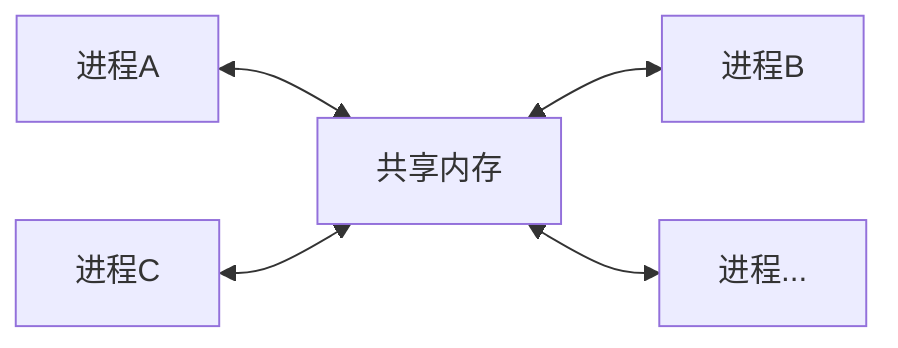

## 为什么使用共享内存

共享内存（Shared Memory）是操作系统提供的一种机制，允许多个进程或者现成访问同一块**内存空间**，这样可以快速的交换数据和消息。

使用共享内存的原因主要包括以下几点：

1. **高性能的数据交换**：共享内存通常比其他通信机制（如管道、消息队列、Socket等）更快，因为它减少了数据复制的次数。在共享内存中，数据只需写入一次，可以被多个进程直接访问。
2. **同步机制**：共享内存通常与同步原语（如互斥锁、信号量等）结合使用，以控制多个进程或线程对共享数据的访问，保证数据的一致性和完整性。
3. **方便的数据共享**：在多进程或多线程应用中，共享内存提供了一种简单的方式来共享大量数据，无需通过繁琐的数据传递过程。
4. **减少资源消耗**：使用共享内存可以减少系统资源的使用，因为它不需要像其他通信机制那样进行数据的多次复制。

在嵌入式系统中，使用共享内存的原因与在通用计算环境中使用共享内存的原因类似，但也具有一些特定的考虑因素。以下是在嵌入式系统中使用共享内存的几个主要原因：

1. **资源限制**：嵌入式系统通常具有有限的资源，包括内存、处理能力和功耗。共享内存可以减少内存占用，因为它允许多个组件或任务共享相同的数据，而不需要为每个组件或任务复制数据。
2. **性能要求**：嵌入式系统经常需要在严格的实时性能要求下运行。共享内存提供了快速的通信机制，可以减少数据传输延迟，这对于满足实时性要求至关重要。
3. **低功耗**：通过减少数据传输和复制，共享内存有助于降低功耗，这对于电池供电的嵌入式设备来说尤为重要。
4. **简化设计**：共享内存可以简化系统设计，因为它减少了需要管理的通信接口数量。这对于减少硬件复杂性和降低成本非常有用。
5. **通信效率**：在多处理器或多核嵌入式系统中，共享内存可以提供高效的处理器间通信，这对于并行处理和任务分配非常重要。




## 共享内存的应用

共享内存函数由shmget、shmat、shmdt、shmctl四个函数组成。

### 函数原型

shmget(得到一个共享内存标识符或创建一个共享内存对象)

```c
#include <sys/ipc.h>
#include <sys/shm.h>


/**
 * 把从pathname(已存在的路径)导出的信息与id的低序8位组合成生成一个唯一的整数IPC键，用户进程间通信
 * __pathname: 指定的文件，此文件必须存在且可存取
 * __proj_id:  计划代号（project ID），这里可以表示为指定共享内存变量的Id，（0-255）
 * key_t一般为32位的int型的IPC键
 */
key_t ftok(const char *__pathname, int __proj_id);


/**
* 得到一个共享内存标识符或创建一个共享内存对象并返回共享内存标识符
* key:  0(IPC_PRIVATE)：会建立新共享内存对象
*       大于0的32位整数：视参数shmflg来确定操作。通常要求此值来源于ftok返回的IPC键值
* size: 大于0的整数：新建的共享内存大小，以字节为单位, 
* 		0：只获取共享内存时指定为0
* shmflg: 0：取共享内存标识符，若不存在则函数会报错
* 		  IPC_CREAT：当shmflg&IPC_CREAT为真时，如果内核中不存在键值与key相等的共享内存，则新建一个共享内存；如果存在这样的共享内存，返回此共享内存的标识符
* 		  IPC_CREAT|IPC_EXCL：如果内核中不存在键值与key相等的共享内存，则新建一个消息队列；如果存在这样的共享内存则报错
*         shmflg参数为模式标志参数，使用时需要与IPC对象存取权限（如0600）进行|运算来确定信号量集的存取权限
* return 成功：返回共享内存的标识符 出错：-1，错误原因存于error中
*/
int shmget(key_t key, size_t size, int shmflg);


/**
* 连接共享内存, 连接共享内存标识符为shmid的共享内存，连接成功后把共享内存区对象映射到调用进程的地址空间，随后可像本地空间一样访问
* __shmid: 共享内存标识符
* *__shmaddr: 指定共享内存出现在进程内存地址的什么位置，直接指定为NULL让内核自己决定一个合适的地址位置
* shmflg: SHM_RDONLY：为只读模式  
* 		  0: 表示默认行为，读写权限
*         SHM_RND: 如果设置了此标识，并且shmaddr部位NULL，共享内存附加地址会向下舍入到SHMLBA中
* return 成功 返回 共享内存段附加在进程地址空间的地址，即进程中使用的共享变量地址
*        失败 返回 (void *)-1 ，并设置errno错误值
*/
void *shmat(int __shmid, const void *__shmaddr, int __shmflg);
    
    

/**
* 断开共享内存连接
* __shmaddr: 连接的共享内存的起始地址, 进程内部访问的共享内存变量地址
*/
int shmdt(const void *__shmaddr);


/**
* 共享内存管理，共享内存的控制， 如删除重置等。没有执行，则共享内存最后状态会保留在内存中，即使程序结束了，也会保存。
* 不常用，应为多个进程中，这里删除了，其他进程无法访问了。可以通过IPC_STAT来判断最后一次附加shmat共享内存的时间,以及断开分离
* shmdt共享内存的时间来判断是否删除等。以及获取有多少个进程操作共享内存。
*
* shmid:
* cmd: IPC_STAT：得到共享内存的状态，把共享内存的shmid_ds结构复制到buf中
* cmd: IPC_SET：改变共享内存的状态，把buf所指的shmid_ds结构中的uid、gid、mode复制到共享内存的shmid_ds结构内
* cmd: IPC_RMID：删除这片共享内存
* buf: 共享内存管理结构体。具体说明参见共享内存内核结构定义部分
*/
int shmctl(int shmid, int cmd, struct shmid_ds *buf);

```


### 示例

创建两个C程序，process_a.c  和 process_b.c。  两个程序访问同一个内存变量，使用ftok操作同一个可访问的pathname文件路径和同一个proj_id标识， 可以使用不同的pathname和不同的proj_id来标识不同的文件索引节点上的不同IPC标识。
其中process_a程序，更新写入 IPC shmKey为(process_a, 65)的内存变量，而process_b程序，读取shmKey同样为(process_a, 65)的内存变量。

process_a.c 文件，编译gcc ./process_a.c -o process_a

```c
/**
 * process_a 文件
 */
#include <stdio.h>
#include <sys/ipc.h>
#include <sys/shm.h>
#include <error.h>
#include <string.h>
#include <unistd.h>

#define SHM_SIZE 1024  // 定义共享内存大小

int main()
{

    key_t key = ftok("process_a", 65);  // 创建一个唯一的键  proj_id 范围 （0-256)  低8位 组合为IPC键值

    // key_t key = ftok("process_a", 257);  // 创建一个唯一的键   257 = 0x101  1=0x01    ，  等价于 <==>  key_t shmKey = ftok("process_a", 1);

    int shmid = shmget(key, SHM_SIZE, IPC_CREAT|0600);   // 创建共享内存, 内存长度为SHM_SIZE
    
    if (shmid < 0)
    {
        perror("shmget error");
        return -1;
    }

    char *shm_value1 = (char *) shmat(shmid, NULL, 0); // 连接共享内存   char 类型

    // int *shm_value2 = (int *) shmat(shmid, (void*)0, 0); // 连接共享内存 int 类型   void*指针，可以任意转换类型


    int i = 0;
    while (i<10)
    {   
        printf("process_a now set shm_value1 to [shm_value1=%d]\n", i);
        sprintf(shm_value1, "shm_value1=%d", i);

        // *shm_value2 = 10*i;   // int类型的直接赋值即可，不需要使用sprintf进行拷贝
        i++;
        sleep(3);

    }

    // 断开共享内存连接
    shmdt(shm_value1);

    return 0;
    
}
```


process_b.c 文件  编译 

```c
/**
 * process_b 文件
 */
#include <stdio.h>
#include <sys/ipc.h>
#include <sys/shm.h>
#include <error.h>
#include <string.h>
#include <unistd.h>

#define SHM_SIZE 1024  // 定义共享内存大小

int main()
{
    // 需要和process_a中，是同样的pathname 和 proj_id ,才能访问到同一个__pathname, 和 proj_id标识的内存变量内存变量

    key_t shmKey = ftok("process_a", 65);  // 创建一个唯一的键  65

    // key_t shmKey = ftok("process_a", 1);  // 创建一个唯一的键  1
    if (-1 == shmKey) {
        perror("获取65的shmKey异常");
        return -1;
    }

    int shmid = shmget(shmKey, SHM_SIZE, IPC_CREAT|0600);   // 创建共享内存, 内存长度为SHM_SIZE
    
    if (shmid < 0)
    {
        perror("shmget error");
        return -1;
    }

    char *shm_value1 = (char *) shmat(shmid, NULL, 0); // 连接共享内存   char 类型
    // char *shm_value1 = (char *) shmat(shmid, NULL, SHM_RDONLY); // 连接共享内存   char 类型  SHM_RDONLY 只读连接，无法修改

    // int *shm_value1 = (int *) shmat(shmid, (void*)0, 0); // 连接共享内存 int 类型   void*指针，可以任意转换类型


    int i = 0;
    while (i<10)
    {
        // 如果没有进行上面的定义
        // sprintf(shm_value1, "new set shm_value1 to %d", i);
        sleep(1);
        printf("process_b read: %s\n", shm_value1);
        i++;
    }

    // 断开共享内存连接
    shmdt(shm_value1);

    return 0;
    
}
```


开两个终端分别运行两个程序，两个程序都谁先运行都可以，因为都使用了ftok和shmget创建了指定的共享内存，不会重复创建。

运行process_a，写入共享内存，3秒更新写一次；运行process_b，读取共享内存，1秒读一次

```shell
keyinwang@WondersWL:~/Projects/DemoC/shared_mem$ ./process_a 
process_a now set shm_value1 to [shm_value1=0]
process_a now set shm_value1 to [shm_value1=1]
process_a now set shm_value1 to [shm_value1=2]
process_a now set shm_value1 to [shm_value1=3]
process_a now set shm_value1 to [shm_value1=4]
process_a now set shm_value1 to [shm_value1=5]

// ......
keyinwang@WondersWL:~/Projects/DemoC/shared_mem$ ./process_b 
process_b read: shm_value1=1
process_b read: shm_value1=1
process_b read: shm_value1=2
process_b read: shm_value1=2
process_b read: shm_value1=2
process_b read: shm_value1=3
```


注意当process_a中途结束或者结束运行时，再次运行process_b时，发现共享内存是最后改动的值，而不是空值，说明即使程序结束运行，而共享内存依然存在，这是因为我们没有使用shmctl删除共享内存。因此就一直保留在内存指定地址中。


### 提示

为了提供共享内存的可读性和复用性，我们可以将pathname节点和proj_id 抽象提取出来表示不通的共享内存变量，并可以设置不通变量的指定shmSize。

如可以定义一个头文件shm_util.h

```c
// shm_util.h 定义各个进程之前的共享内存参数

/**
 * shm_device_status:  运行状态  int *shm_device_status
 * 0：已开机
 * 1：开机中
 * 2：开机成功
 * 3：关机中
 * 4：重启中
 * 5：升级中
 * -1：运行出错 
 */
#define SHMID_DEVICE_STATUS 1    // proj_id = 1表示  device_status 的内存变量shm_device_status，定义值保存了int类型的，用来表示设备不通时期的状态，需要共享给其他程序。
/**定义status共享内存长度 */
#define SHMSIZE_STATUS 8    // 这里定义 shmsize_status 

/** pathname */
#define SHMPATHNAME_PROCESS "/home/keyinwang/Projects/DemoC/shared_mem/process_c"

/**
 * shm_battery_voltage:  电池电压  char *shm_device_status
 * float 转 chat []   如 5.000   4.890    单位V
 */
#define SHMID_BATTERY_VOLTAGE 2
/**定义status共享内存长度 */
#define SHMSIZE_VOL 6    // 这里定义 shmsize_vol
```

共享内存写进程process_c.c

```c
/**
 * process_c 文件
 */
#include <stdio.h>
#include <sys/ipc.h>
#include <sys/shm.h>
#include <error.h>
#include <string.h>
#include <unistd.h>


/**引入公共定义好的共享变量参数 */
#include "shm_util.h"

int main()
{
    // 第一个共享变量
    key_t shmKey = ftok(SHMPATHNAME_PROCESS, SHMID_DEVICE_STATUS);  // 创建一个唯一的键
    if (-1 == shmKey) {
        perror("获取 SHMPATHNAME_PROCESS  SHMID_DEVICE_STATUS 的shmKey异常");
        return -1;
    }
    int shmid = shmget(shmKey, SHMSIZE_STATUS, IPC_CREAT|0600);   // 创建共享内存, 内存长度为SHM_SIZE
    
    if (shmid < 0)
    {
        perror("shmget SHMID_DEVICE_STATUS error");
        return -1;
    }
    int *shm_device_status = (int *) shmat(shmid, (void*)0, 0); // 连接共享内存

    // 第二个共享变量
    shmKey = ftok(SHMPATHNAME_PROCESS, SHMID_BATTERY_VOLTAGE);  // 创建一个唯一的键
    shmid = shmget(shmKey, SHMSIZE_VOL, IPC_CREAT|0600);   // 创建共享内存, 内存长度为SHMSHZI_VOL
    if (shmid < 0)
    {
        perror("shmget SHM_BATTERY_VOLTAGE error");
        return -1;
    }
    char *shm_battery_voltage = (char *) shmat(shmid, NULL, 0); // 连接共享内存


    int i = 0;
    while (i<10)
    {   
        *shm_device_status = i;
        printf("set int *shm_device_status=%d\n", *shm_device_status);


        sprintf(shm_battery_voltage, "%d.000V", i);
        printf("set char *shm_battery_voltage=%s\n", shm_battery_voltage);
       
        sleep(3);
        
        i++;
    }

    // 断开共享内存连接
    shmdt(shm_device_status);
    shmdt(shm_battery_voltage);

    return 0;
}
```

共享内存读进程process_d.c

```c
/**
 * process_c 文件
 */
#include <stdio.h>
#include <sys/ipc.h>
#include <sys/shm.h>
#include <error.h>
#include <string.h>
#include <unistd.h>


/**引入公共定义好的共享变量参数 */
#include "shm_util.h"

int main()
{
    // 第一个共享变量
    key_t shmKey = ftok(SHMPATHNAME_PROCESS, SHMID_DEVICE_STATUS);  // 创建一个唯一的键
    if (-1 == shmKey) {
        perror("获取 SHMPATHNAME_PROCESS  SHMID_DEVICE_STATUS 的shmKey异常");
        return -1;
    }
    int shmid = shmget(shmKey, SHMSIZE_STATUS, IPC_CREAT|0600);   // 创建共享内存, 内存长度为SHM_SIZE
    
    if (shmid < 0)
    {
        perror("shmget SHMID_DEVICE_STATUS error");
        return -1;
    }
    int *shm_device_status = (int *) shmat(shmid, (void*)0, 0); // 连接共享内存

    // 第二个共享变量
    shmKey = ftok(SHMPATHNAME_PROCESS, SHMID_BATTERY_VOLTAGE);  // 创建一个唯一的键
    shmid = shmget(shmKey, SHMSIZE_VOL, IPC_CREAT|0600);   // 创建共享内存, 内存长度为SHMSHZI_VOL
    if (shmid < 0)
    {
        perror("shmget SHM_BATTERY_VOLTAGE error");
        return -1;
    }
    char *shm_battery_voltage = (char *) shmat(shmid, NULL, 0); // 连接共享内存


    int i = 0;
    while (i<10)
    {   

        sleep(1);
        printf("process_d read int *shm_device_status: %d\n", *shm_device_status);
        printf("process_d read char *shm_battery_voltage: %s\n", shm_battery_voltage);
        i++;
    }

    // 断开共享内存连接
    shmdt(shm_device_status);
    shmdt(shm_battery_voltage);

    return 0;
}
```

编译Makefile

```makefile
TARGETS = process_c process_d

# # 列出所有.c文件
# SRCS = $(wildcard *.c)
# # 根据SRCS生成点o文件
# OBJS = $(patsubst %.c, %.c.o, $(SRCS))

SRCS1=process_c.c
OBJS1=$(SRCS1:.c=.o)

SRCS2=process_d.c
OBJS2=$(SRCS2:.c=.o)

all: $(TARGETS) 


process_c: $(OBJS1)
	$(CC) $^ $(LIBS) $(LDFLAGS) $(LOCAL_LDFLAGS) -o $@


process_d: $(OBJS2)
	$(CC) $^ $(LIBS) $(LDFLAGS) $(LOCAL_LDFLAGS) -o $@


process_c.o: process_c.c
	$(CC) $(CFLAGS) $(INCLUDES) -c $^ -o $@

process_d.o: process_d.c
	$(CC) $(CFLAGS) $(INCLUDES) -c $^ -o $@


clean:
	rm -rf $(TARGETS) $(OBJS1) $(OBJS2)


.PHONY: all clean

```

编译执行

```shell
keyinwang@WondersWL:~/Projects/DemoC/shared_mem$ make
cc   -c process_c.c -o process_c.o
cc process_c.o    -o process_c
cc   -c process_d.c -o process_d.o
cc process_d.o    -o process_d

// 终端1执行
keyinwang@WondersWL:~/Projects/DemoC/shared_mem$ ./process_c 
set int *shm_device_status=0
set char *shm_battery_voltage=0.000V
set int *shm_device_status=1
set char *shm_battery_voltage=1.000V
set int *shm_device_status=2
set char *shm_battery_voltage=2.000V
set int *shm_device_status=3
set char *shm_battery_voltage=3.000V

// 终端2执行
keyinwang@WondersWL:~/Projects/DemoC/shared_mem$ ./process_d
process_d read int *shm_device_status: 2
process_d read char *shm_battery_voltage: 2.000V
process_d read int *shm_device_status: 2
process_d read char *shm_battery_voltage: 2.000V
process_d read int *shm_device_status: 3
process_d read char *shm_battery_voltage: 3.000V
```

至此，完成了多个进程只想的共享内存使用。
